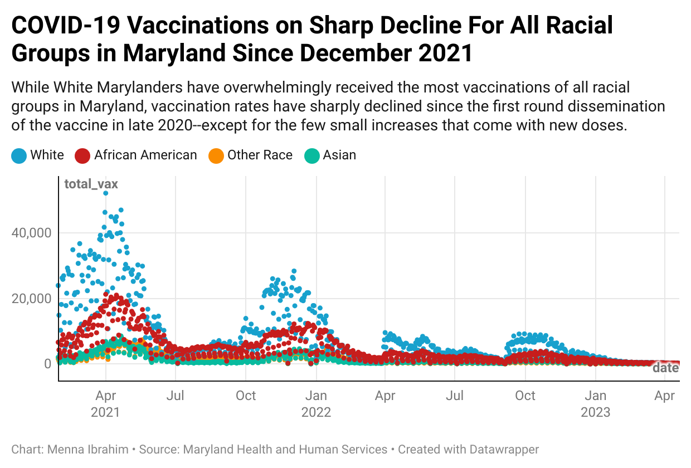
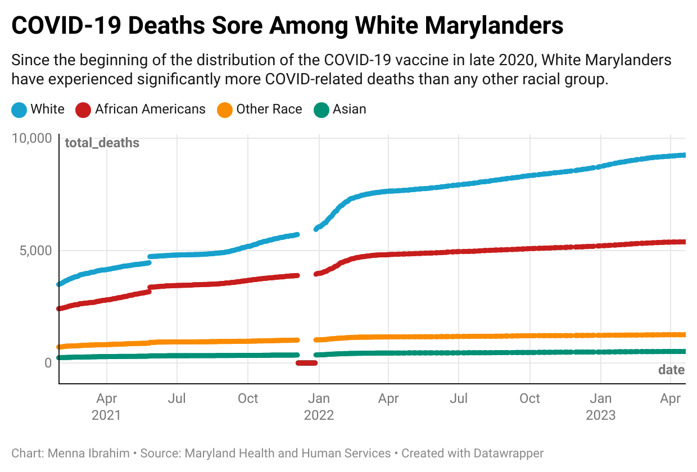

```{r setup, include=FALSE}
knitr::opts_chunk$set(echo = TRUE)
install.packages("sf")
```

## First I will load some libraries that I hope will prove themselves useful (basically most of the ones I know, I am not too certain which I will end up using)

```{r}
# Load libraries
library(tidyverse)
library(magrittr)
library(sf)
library(janitor)
library(tidycensus)
library(tigris)
library(ggplot2)
library(lubridate)
options(tigris_use_cache=TRUE)
```

## WAIT let me do some research before I start anything

I am working with a Maryland COVID-19 Confirmed Death by Race dataset (https://opendata.maryland.gov/Health-and-Human-Services/MD-COVID-19-Confirmed-Deaths-by-Race-and-Ethnicity/qwhp-7983_) and a Maryland COVID-19 Vaccination by Race dataset (https://opendata.maryland.gov/Health-and-Human-Services/MD-COVID-19-Vaccinations-by-Race-Distribution/juj8-ujbh). 

# Who created and maintains these two data sets? What state program or law is connected to it?

The Confirmed Death by Race Data is provided by the Maryland Department of Health Vital Statistics Administration and maintained by the data is  Department of Health and Human Services. The Vaccinations by Race Data is provided by the Maryland Department of Health Prevention and Health Promotion Administration and the data is maintained by Department of Health and Human Services. According to the department, both of these data sets are provided without warranty of any kind, either expressed, implied, or statutory. 

# What does each row represent?

In the Confirmed Death by Race Data, each row represents a single day and each column represents a racial group. 

In the Vaccinations by Race Data, each row represents a day for a single racial group. So for example, 12/04/23 for White people is a different row than 12/04/23 for Black people.

#What is the chronological and geographic scope of this data?

Geographically, both of these data sets represent Maryland state and do not break down any further. 

Chronologically, the Vaccinations by Race dates back to 1971 (huhhhh) and stops in April 2023. On the other hand, the Confirmed Death by Race Data dates back to April 2021 and stops in November 2023.

## Now I am going to load my COVID-19 vaccination by race data and clean it up

Something here is clearly very wrong because it dates back to data as early as 1971, so they either knew about the coronavirus way back when (unlikely and untrue) or they accounted for vaccinations of all kinds in this dataset. This is really frustrating and surely going to mess up my work.

```{r}
vax_race_rates <- read_csv('data/MD_COVID-19_-_Vaccinations_by_Race_Distribution.csv') |>
  clean_names()
```

I feel like the N/As are going to cause me a whole bunch of problems later on so I asked ChatGPT how to replace them with zeros.

```{r}
vax_race_rates <- vax_race_rates |>
  mutate_all(~replace(., is.na(.), 0))
```

I am going to get rid of the times because I don't actually think they matter--they are simply all in the morning between 10 and 11am, which I truly doubt are accurately reported given the nature of the data provided; however, I forgot how to do that so I copied and pasted my code into ChatGPT and asked it what I was doing wrong in this scenario given the libraries I was using--turns out I needed that format bit. I know we did it a little differently in class (mdy) but this does the trick!).
 
```{r}
clean_vax_race_rates <- vax_race_rates |>
  mutate(vaccination_date = as_datetime(vaccination_date, format = "%m/%d/%Y %I:%M:%S %p"),
         vaccination_date = as_date(vaccination_date))
```

I am going to exclude all vaccinations conducted before the first COVID vaccine became available to the public in Maryland, Dec 14, 2020, according to the HHS (https://www.hhs.gov/coronavirus/covid-19-vaccines/index.html#:~:text=During%20the%20COVID%2D19%20pandemic,began%20on%20December%2014%2C%202020.) and the Baltimore Sun (https://www.baltimoresun.com/2020/12/14/first-doses-of-covid-19-vaccine-injected-into-health-care-workers-in-maryland/). I know this may include some vaccinations that weren't for COVID-19 but because there is no column for vaccination type and the dataset is called COVID-19 Vaccinations, I am going to operate as if they are all COVID-19 vaccinations.

```{r}
vax_dates <- clean_vax_race_rates |>
  mutate(vaccination_date=ymd(vaccination_date)) |>
  filter(vaccination_date > "2020-12-14")
```

I am going to make my dataset more presentable now--I should have done this earlier, my bad!

```{r}

#I don't know the difference between the cumulative and the single dose columns, but I worry that the cumulative data adds rates from previous days so I am going to exclude those and just work with the single. I am also going to exclude the fully vaccinated column because that's no longer relavent now that we have introduced boosters. 

vax_dates <- vax_dates |>
  select(-first_dose_cumulative, -second_dose_cumulative, -single_dose_daily, -single_dose_cumulative, -fullyvaccinated, -fullyvaccinatedcumulative, -thirddosecumulative, -additionaldosecumulative, -secondadditionaldosecumulative)

#I am also going to get rid of all the rows that include "Unknown Race" and "Federal Entities" because that's actually unhelpful

vax_dates <- vax_dates |>
  filter(race != "Unknown Race") |>
  filter(race != "Federal Entities")

# A lot of folks are getting fourth doses before third doses, which indicates to me that many are considering their booster as their third dose. With that in mind, I am going to combine the third dose data with the booster data so it is easier to look at

vax_dates <- vax_dates |>
  mutate(third_dose = thirddosedaily + firstboosterdailydose) |>
  select(-thirddosedaily, -firstboosterdailydose)

#I am also going to change the naming conventions to all look like the one above

vax_dates <- vax_dates |>
  rename(first_dose = first_dose_daily) |>
  rename(second_dose = second_dose_daily) |>
  rename(fourth_dose = fourthdailydose)

# This is a bit confusing so I'm going to make them in a better order

vax_dates <- vax_dates |>
  select(vaccination_date, race, first_dose, second_dose, third_dose, fourth_dose)

```

Now for some summary data before I join it with anything else (which I will also have to clean probably oh god)

```{r}

# Creating a new dataframe so it doesn't get confusing for me, don't mind me

vax_by_race <- vax_dates

```

# Q: Which racial group overall has gotten the most vaccines since it began getting administered?

I also want to visualize this in some way to make it easier to see the differences: https://datawrapper.dwcdn.net/jidAO/1/.

Check it out here or in the folder!

# A: In Maryland, White people received overwhelmingly more vaccines than any other racial groups--just over 7 million in fact. The racial group that directly follows them, Black/African American folks, is almost 4 MILLION less, which is unsurprising but very jarring nonetheless. While White, Black, Asian, and "Other Races" each have at least a million vaccines receieved, Native Americans/Alaskan Natives only have almost 110,000 while Pacific Islanders have receieved just 32,000 vaccines since the start of vaccine administration in late 2020. 

```{r}
total_vax_by_race <- vax_by_race |>
  mutate(vax_per_day = first_dose + second_dose + third_dose + fourth_dose) |>
  group_by(race) |>
  summarise(
    total_doses = sum(vax_per_day)) |>
  arrange(desc(total_doses))
  
write_csv(total_vax_by_race, "data/total_vax_by_race.csv")
```

This is insane to me, but I also do understand that the census data would help me get a better picture given that perhaps there are just significantly less of the lower end racial groups in Maryland than the higher end ones. I will find that out shortly!

# Q: Which racial groups had the most and least rates of first doses vs who had the most and least rates of fourth doses. 

I can imagine while most people got the first dose, some groups may have stopped following up the further into the pandemic we got.

# A1: Those of "Other Races" and Black folks reportedly had some of the greatest first dose rates, which indicates to me that these individuals stopped taking the vaccine shortly after their first dose, since they had somewhat high rates in terms of overall vaccination reception. Natives also had very high first dose rates comparatively, which tells me that perhaps there are just very few of folks from these racial groups in the Maryland area since htey had such low reception numbers. Asians and White people had the lowest rates but not by much. 

While this is interesting for the way it explained some things (that will later be confirmed by the census data) about the Native population in Maryland, it truly doesn't tell me much about who continued taking new doses of the COVID-19 vaccine since they were all about the same, so I am eager to look at the fourth dose rates. I have my guesses based on the initial summary above but let's check the data for some substantiated answers.

```{r}

vax_by_race |>
  group_by(race) |>
  summarise(
    first_dose_rate= sum(first_dose)/sum(first_dose + second_dose + third_dose + fourth_dose) *100) |>
  arrange(desc(first_dose_rate))

```

# A2: As I predicted, White people have the highest rate of retention when it has come to taking the COVID-19 vaccine since late 2020 with a rate of just over 11%. This group is very shortly followed by Asians with just over 10%, which indicates to me that while there are more Black folks in Maryland, Asian people continued taking the vaccine even after the first few doses. I am surprised to see that those classified as "Other Race" have significantly lower rates than anyone else, including Natives.

```{r}

vax_by_race |>
  group_by(race) |>
  summarise(
    fourth_dose_rate= sum(fourth_dose)/sum(first_dose + second_dose + third_dose + fourth_dose) *100) |>
  arrange(desc(fourth_dose_rate))

```
## Before I load the census data, I want to load my COVID-19 Confirmed Deaths by Racial Groups data and clean it up just to see if there are (unfortunate but) similar trends available

```{r}
confirmed_covid_deaths_by_race <- read_csv('data/MD_COVID-19_-_Confirmed_Deaths_by_Race_and_Ethnicity_Distribution.csv') |>
  clean_names()
```

I am going to make my dataset more presentable now!

```{r}
#I dam going to get rid of the columns I don't need

clean_covid_deaths_by_race <- confirmed_covid_deaths_by_race |>
  select(-objectid, -not_available)

# Because the previous dataset didn't account for Hispanic folks as their own racial group, I am going to join that column with the "other" column to make them easier to compare

clean_covid_deaths_by_race <- clean_covid_deaths_by_race |>
  mutate(other = hispanic + other) |>
  select(-hispanic)

# Time to shape up that date column, praying it doesn't give me as much grief as the last dataset

clean_covid_deaths_by_race <- clean_covid_deaths_by_race |>
  mutate(date = as_datetime(date, format = "%m/%d/%Y %I:%M:%S %p"),
         date = as_date(date))

```

I want to exclude all the people that unfortunately passed away before the vaccine became administered

```{r}

clean_covid_deaths_by_race <- clean_covid_deaths_by_race |>
  mutate(date=ymd(date)) |>
  filter(date > "2020-12-14")

```

Based on what I know about the timeline of effectiveness of the COVID-19 vaccine, as well as some research I conducted through the Maryland Department of Health (https://health.maryland.gov/newsroom/Pages/Maryland-Department-of-Health-releases-COVID-19-post-vaccination-infections-data.aspx#:~:text=Vaccines%20remain%20the%20best%20way,%2Dauthorized%20COVID%2D19%20vaccine.), it takes up to 14 days after your last administered dosage for you to be fully protected. Because the most ubiquitous vaccine types in Maryland were Pfizer and Moderna, which both required two doses, I am going to exclude all the folks that could have seemingly not had full protection from the vaccine yet when they passed. Because the first group of individuals received a first dose on 12/15/2020 and had to wait approximately 30 days for their second dose and then another 14 days before they were fully protected, I am excluding everyone that passed on or before 01/28/2021.

```{r}

clean_covid_deaths_by_race <- clean_covid_deaths_by_race |>
  mutate(date=ymd(date)) |>
  filter(date >= "2021-01-28")

```

I am now realizing that this is goin got be very hard to get summary data from so I asked ChatGPT how to turn my columns into one single column for "race" and add a column that says "total deaths" so I can pull things out easier. I tweaked the code a little but this is the gist of what it gave me.

```{r}
clean_covid_deaths_by_race <- clean_covid_deaths_by_race |>
  pivot_longer(cols = -date, names_to = "racial_group", values_to = "total_deaths")

clean_covid_deaths_by_race <- clean_covid_deaths_by_race |>
  rename(race = racial_group)
```

Now for some summary data! However, I am very disappointed that this dataset doesn't account for Native Americans as their own group--I assume they are listed in "Other which makes the two dataset significantly harder to compare; therefore, I will mostly be comparing the data for White,  Black, and Asian Marylanders here.

# Q: Which racial group has overall had the most COVID-related deaths since the start of vaccine administration in Maryland?

I had to ask ChatGPT how to exclude the N/As because they were causing me trouble in my sum

# A: This indicates that white people have overwhelmingly had more covid deaths since the vaccine has been administered, which is really confusing to me giivng their overwhelmingly high rates of vaccination. This makes me want to question the vaccines efficacy (I will not), but it also makes me wonder if the white population in Maryland is just older or more vulnerable health wise than the others because Asian folks, according to this data, are the overwhelming minority in terms of covid deaths, which is consistent with their vaccination rates. 

```{r}

clean_covid_deaths_by_race |>
  group_by(race) |>
  summarise(total_deaths = sum(total_deaths, na.rm = TRUE)) |>
  arrange(desc(total_deaths))

```

# Q: I am also curious to know which of the three years included in this dataset had the most deaths because if early 2021 is a big outlier than I can remove it given that the vaccine may not have been accessible enough to have an impact on the Maryland population

# A: In an unexpected turn of events, it seems as though 2022 has the most deaths with a little over 100 more than 2021, so I will not change anything about this dataset in that regard

```{r}

clean_covid_deaths_by_race |>
  mutate(year = year(date)) |>
  group_by(year) |>
  summarise(
    count=n()) |>
  arrange(desc(count))

```

I know about I spent so much time talking about the Census data but after loading it and acs5 data, I realized that I have no basis through which to join the two dataframes. This is a bit disappointing because I really wanted to make a map of the racial great down of races in Maryland as it pertains to COVID-19 but I will instead join the two dataframes to see how death correlates with vaccinations in a visual sense.

# I want to join the two data sets now!

First I need to clean them both up so they look more similar. I know I can join on the basis of date but I would like to join on race as well. 

This means I need to make all the values in my vax by race data frame look like the ones in the race column of the covid deaths data frame.

```{r}

#I couldn't remember how to replace a value so I asked ChatGPT the following: "how to change naming conventions in a cell? can i use string detect then rename?" to which ChatGPT was not helpful and led me astray. It thought I wanted to change the name of a column instead. After I realized that didn't work I asked the following: "what if i don't want to change a column? i want to change a value in my dataset to have a different name," to which (surprise surprise) ChatGPT once again did not understand. After a lot more research and many trials and errors, I finally got what I needed when I asked the following question: "what if i don't want to replace a column name. I want to instead, for example, replace all the "AMERICAN INDIAN OR ALASKAN NATIVE"  values in my race column with "other" how do i do that?"

edited_vax_by_race <- vax_by_race |>
  mutate(race = if_else(race == "AMERICAN INDIAN OR ALASKAN NATIVE", "other", race)) |>
  mutate(race = if_else(race == "ASIAN", "asian", race)) |>
  mutate(race = if_else(race == "BLACK OR AFRICAN AMERICAN", "african_american", race)) |>
  mutate(race = if_else(race == "Other Race", "other", race)) |>
  mutate(race = if_else(race == "WHITE", "white", race)) |>
  mutate(race = if_else(race == "NATIVE HAWAIIAN OR OTHER PACIFIC ISLANDER", "other", race))

edited_vax_by_race <- edited_vax_by_race |>
  rename(date = vaccination_date)

# I want to combine all the "other" into one row. I couldn't remember how to do that so I spent a long time asking ChatGPT. The question that finally clicked was just inputting what I'd been working with and asking what I was doing wrong. Turns out I wasn't using that "across" correctly nor did I include the "c"

edited_vax_by_race <- edited_vax_by_race |>
  group_by(date, race) |>
  summarise(across(c(first_dose, second_dose, third_dose, fourth_dose), sum))

# For comparison's sake when I join the data frames, I am going to exclude everythign before 01/29/2023

edited_vax_by_race <- edited_vax_by_race |>
  filter(date > "2021-01-28")

```

Time to join!

```{r}

vax_data_with_death_data <- 
  edited_vax_by_race |> 
  left_join(clean_covid_deaths_by_race, join_by(date, race))

```

Having joined this data, I realize that the doses don't actually make it any more appealing or comprehensible so I am going to add a total vaccination column and create a chart to show the vaccine and trends per race over time

```{r}
vax_data_with_death_data <- vax_data_with_death_data |>
  mutate(total_vax = first_dose + second_dose + third_dose + fourth_dose)

write_csv(vax_data_with_death_data, "data/vax_data_with_death_data.csv")

```

After writing out this csv, I realized that ALL of these dates is so overwhelming to the eye. I think it may be visually more appealing to look at 6 month intervals--end of June and end of December, so I will filter for those dates. Because the data doesn't go as far as June 2023, I am going to include the last available data for that year, which is April 20, 2023. I do understand that perhaps those specific days may be outliers, but I really hope not.

```{r}

filtered_vax_data_with_death_data <- vax_data_with_death_data |>
  filter(date == "2021-06-30" | date == "2021-12-31" | date == "2022-06-30" | date == "2022-12-31" | date == "2023-04-20" )

write_csv(filtered_vax_data_with_death_data, "data/filtered_vax_data_with_death_data.csv")
  
```

After looking at this weird looking scatterplot I just made in datawrapper, I am realizing I may need to add more data, so I am going to do Aprils, Augusts, and Decembers instead

```{r}
refined_vax_data_with_death_data <- vax_data_with_death_data |>
  filter(date == "2021-03-30" | date == "2021-07-31" | date == "2021-11-30" | date == "2022-03-30" | date == "2022-07-31" | date == "2022-11-30" | date == "2023-03-30" )

write_csv(refined_vax_data_with_death_data, "data/refined_vax_data_with_death_data")
```

Scratch that. It's still not enough data. I honestly think the best way to do this is to visualize two scatterplots and set them side by side to compare them because it's too overwhelming to look at together. I am going to do that now!

Check out the total vax trends scatterplot below or using this link: https://datawrapper.dwcdn.net/Y9GLZ/1/

```{r, echo=FALSE}

```

Check out the total trends by race scatterplot here or using this link: https://datawrapper.dwcdn.net/nqwnY/1/

```{r, echo=FALSE}

```
It's a bit hard to compare these given that they have such different Y axes, but giving out more vaccinations than folks dying is never ever something I'll complain about.

## Let's talk!

So many things gave me grief as I was trying to clean up these dataset and join them. I already touched on a few, but here they are  in a list:
1. The covid-19 vaccination by race dataset includes dates from all the way back to 1974, which is insane and made it hard to find a reliable date where I could accurately determine that the data included actually represents a covid vaccine.
2. It also didn't indicate the type of vaccine an individual received, which made it hard to determine which vaccines were boosters and which were regular rounds (Pfizer 2, Moderna 2, and I didn't even account for J&J which was 3). 
3. The columns were named in very strange ways and had no explanations online 
4. The dataset did not account for Hispanic folks, which account for a sizable population in Maryland, while the statewide death by race dataset didn't account for Native Americans or Pacific Islanders

But having finally successfully joined these two dataframes, I have so many questions that I think could feed into story ideas. 

For one, I want to know why in the world White Marylanders are dying at such higher rates than any other racial group in the state when they are overwhelmingly taking so many more vaccines than anyone else (even with the drop off rate since the first few doses).

I also want to know why there is a drop off in the data for all of these racial groups' total death data in late 2021 and what that looked like for vaccine distribution. 

I think it would also be interesting to specifically explore how lifting sanctions that made the covid-19 vaccine mandatory impacted death rates because the data clearly shows that plenty of folks across all racial groups are dying of covid-19 today while vaccine rates have dropped off so severely.

There are many other things that I want to explore, but would require a lot more research and data that I didn't have access to/time for. I really really wanted to integrate the census data because it would be fascinating to know get holisitc vaccination rates that account for how many people of each racial group are in the area--without it I actually don't think the numbers are that helpful because, for example, while the data shows that Asians received very few vaccines in comparison to their counterparts, they may actually have much higher rates given the population in this area, so that's a bummer. 

I also think it would be important to account for county or zip code data here. Race is a very very small factor of this entire problem. It would be nice to see how race breaks down by county or zip code in Maryland and include the other factors that come with that like socioeconomic levels or education levels in understanding this data. 